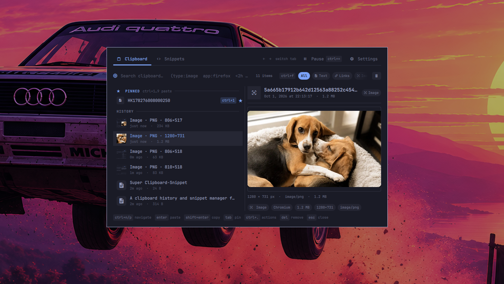
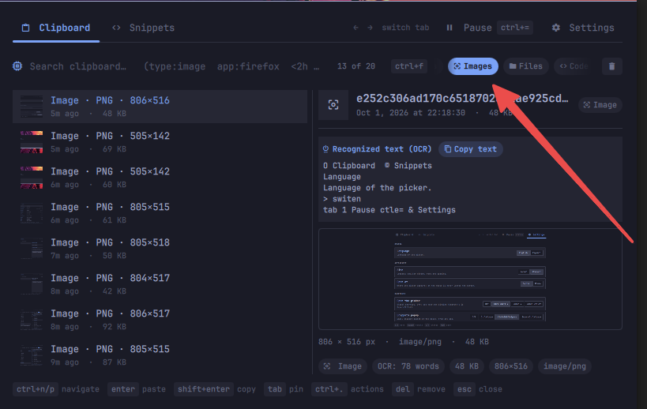
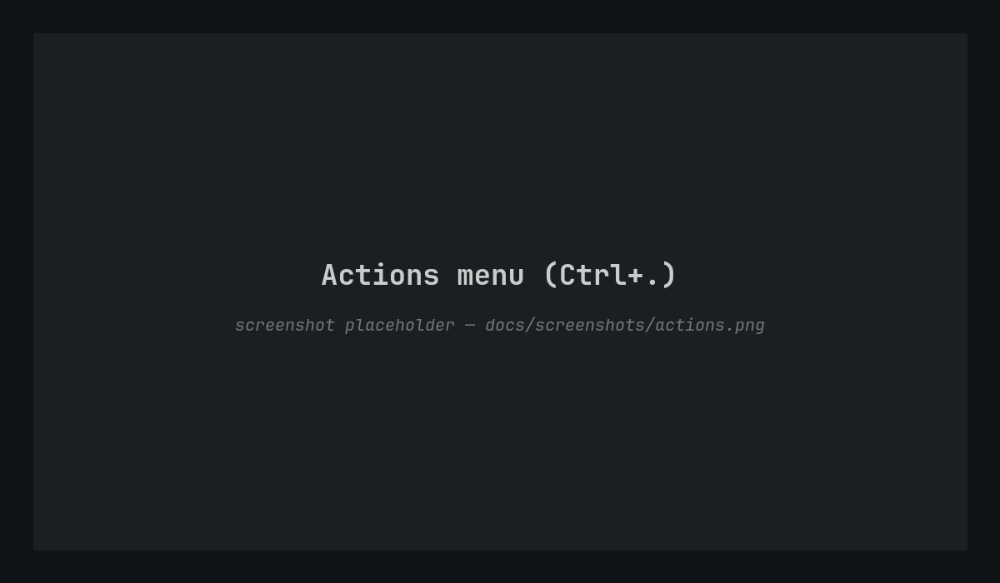
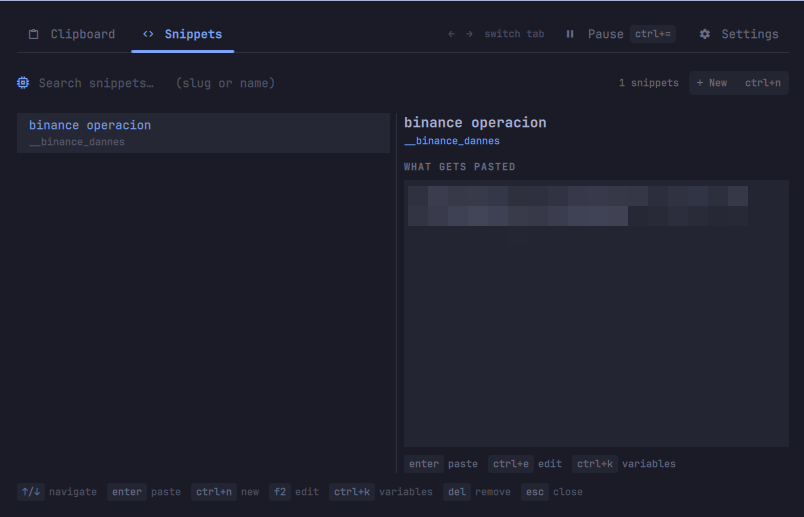
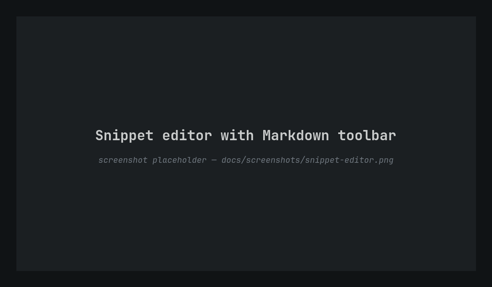
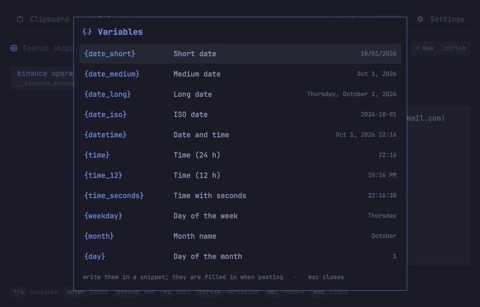
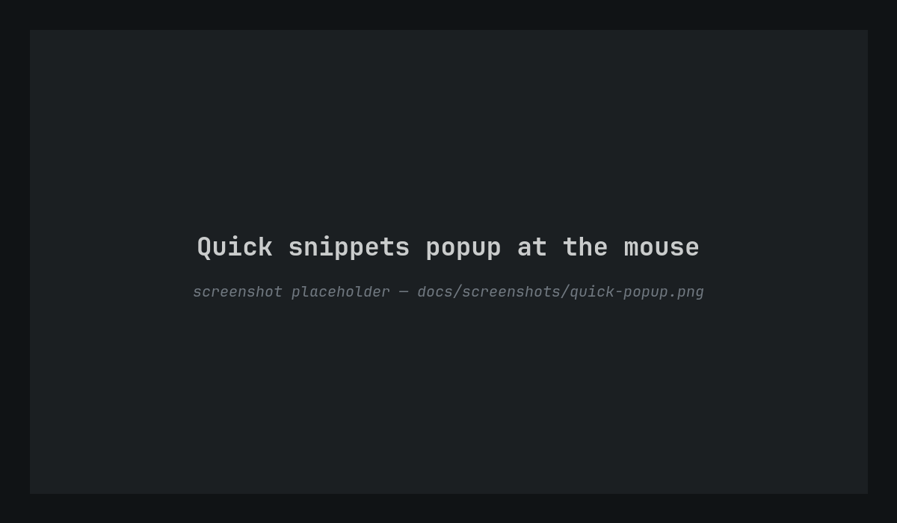
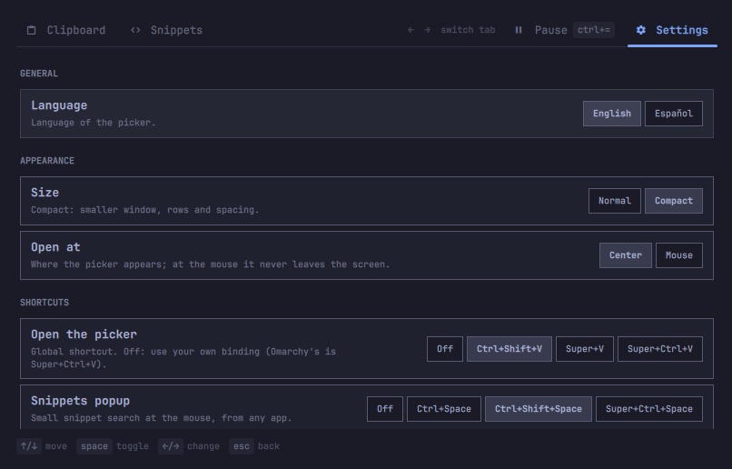

# Super Clipboard-Snippet

A clipboard history and snippet manager for [Omarchy](https://omarchy.org), built as
an Omarchy shell plugin. Two tabs in one picker: **Clipboard** for everything you
copy, with fuzzy search, pins and rich previews, and **Snippets** for reusable
templates with date and time variables. A small popup at the mouse pastes a snippet
from any app.

<p align="center">
  
</p>

## Highlights

- **Two tabs, one picker.** Clipboard and Snippets, switched with `←` / `→`.
- **Fuzzy search over everything.** Content, source app, type and date, with query
  tokens:
  - `type:image|link|text|files|code|json|color|email|html|number` (prefix match)
  - `app:firefox`: fuzzy match on the source app
  - `is:pinned`, `today`, `yesterday`, `week`, `<2h`, `>30s`, `<3d`
- **Type filters next to the search bar.** `Ctrl+F` enters filter mode and `←` / `→`
  walk through the filters.
- **Pins in their own group.** Pinned clips stay on top with a fixed number:
  `Ctrl+1…9` pastes pin N. Pins never expire, never count against the limits and
  survive clearing the history.
- **Rich previews.** Images, QR codes with their decoded content, OCR text of
  screenshots, color swatches, pretty-printed JSON, links and file lists.
- **Edit, annotate, transform.** `F2` / `Ctrl+E` edits a text clip in place,
  `Ctrl+M` attaches a searchable note, and `Ctrl+.` opens an actions menu that
  depends on the clip type (trim, change case, sort lines, format JSON, copy a color
  as HEX/RGB/HSL, open a link, copy the OCR text…).
- **Snippets.** A name, a short slug to find it (`__bank_account`) and Markdown text
  with variables (`{date_long}`, `{time}`, `{clipboard}`…) that are filled in when
  pasting.
- **Quick snippets popup.** A tiny search at the mouse, on a global shortcut, to
  paste a snippet into whatever app you are typing in.
- **Settings inside the picker.** Limits (count, age, image cache, history size),
  normal or compact size, center or at-the-mouse placement, a list-only zen mode, global shortcuts,
  language, and import/export of snippets and settings.
- **English and Spanish.** English by default; the language is a setting.
- **Pause recording** from a button or `Ctrl+=`.
- **Theme-integrated.** Colors, spacing and fonts come from the Omarchy shell theme.

<p align="center">
  
</p>

## Install

```bash
omarchy plugin add https://github.com/LeninZapata/omarchy-super-clipboard-snippet.git --enable
```

It replaces the built-in `omarchy.clipboard` (its manifest declares
`clonedFrom: omarchy.clipboard`), so Omarchy's own clipboard shortcut, `Super+Ctrl+V`,
opens it. Disabling the plugin brings the built-in back.

To use your own keys instead, open **Settings → Shortcuts** and choose one for
**Open the picker** and one for the **Snippets popup**. The plugin registers them in
Hyprland at runtime and never edits your `bindings.lua`.

### Uninstall

```bash
omarchy plugin remove leninzapata.super-clipboard-snippet
```

This removes the plugin and its runtime shortcuts, and brings back the built-in
`omarchy.clipboard`. Your history, snippets and settings are kept, so a reinstall picks
them up. To erase them too:

```bash
rm -rf ~/.local/state/omarchy/super-clipboard-snippet ~/.config/omarchy/super-clipboard-snippet
```

### Dependencies

All of them are regular Arch packages, and Omarchy ships most of them.

| Package | Why | Required |
|---|---|---|
| `wl-clipboard` | `wl-paste` records the clipboard, `wl-copy` writes it | yes |
| `jq` | reads the history in the paste and open helpers | yes |
| `python` | clipboard capture (`capture.py`) | yes |
| `wtype` | pastes into the focused window | yes |
| `zbar` | decodes QR codes in copied images | no |
| `tesseract` | OCR, so text inside screenshots is searchable | no |
| `ffmpeg`, `poppler` | previews of copied video, audio and PDF files | no |

Without the optional ones the picker still works, and it shows the exact command to
install what is missing.

## Clipboard

<p align="center">
  
</p>

| Key | Action |
|---|---|
| type | search |
| `↑` `↓` · `Ctrl+N` `Ctrl+P` | move |
| `Page Up` `Page Down` · `Home` `End` | jump |
| `Enter` | paste into the focused window |
| `Shift+Enter` | copy only |
| `Ctrl+O` · `Alt+Enter` | open (link in the browser, image in the editor, file in its app) |
| `Ctrl+Shift+C` | copy the clip as plain text (for images, their OCR text or QR content) |
| `Tab` | pin / unpin |
| `Ctrl+1…9` | paste pin N |
| `F2` · `Ctrl+E` | edit a text clip in place |
| `Ctrl+M` | add or edit the clip's note |
| `Ctrl+.` | actions menu |
| `Ctrl+F` | filter mode: `←` `→` move between the type filters |
| `Delete` | remove the clip |
| `Shift+Delete` | clear the history (type the confirmation word; pins are kept) |
| `Ctrl+=` | pause / resume recording |
| `←` `→` | switch tab |
| `Ctrl+S` · `Ctrl+,` | settings |
| `Esc` | clear the search, then close |

Hovering a row with the mouse shows pin and delete buttons.

## Snippets

<p align="center">
  
</p>

A snippet has a **name**, a **slug** (a short code such as `__bank_account`) and a
**text** in Markdown. Search matches the slug first, then the name. The right pane
shows exactly what will be pasted, with the variables already filled in.

| Key | Action |
|---|---|
| type | search by slug or name |
| `↑` `↓` | move |
| `Enter` | paste with the variables filled in |
| `Shift+Enter` | copy only |
| `Ctrl+N` | new snippet |
| `F2` · `Ctrl+E` | edit |
| `Ctrl+K` | variables |
| `Delete` | delete (asks for confirmation) |
| `Ctrl+S` · `Ctrl+,` | settings |

<p align="center">
  
</p>

In the editor, the toolbar wraps the selection in **bold**, *italic*, `code`, a code
block or a list, and inserts variables. `Tab` moves to the next field,
`Ctrl+B` / `Ctrl+I` format the selection, `Ctrl+Enter` saves and `Esc` cancels.

### Variables

<p align="center">
  
</p>

`Ctrl+K` lists every variable with a live example. Dates follow the picker language.

| Variable | English | Spanish |
|---|---|---|
| `{date_short}` | 10/01/2026 | 01/10/2026 |
| `{date_medium}` | Oct 1, 2026 | 1 oct 2026 |
| `{date_long}` | Thursday, October 1, 2026 | jueves, 1 de octubre de 2026 |
| `{date_iso}` | 2026-10-01 | 2026-10-01 |
| `{datetime}` | Oct 1, 2026 19:05 | 1 oct 2026 19:05 |
| `{time}` | 19:05 | 19:05 |
| `{time_12}` | 7:05 PM | 7:05 PM |
| `{time_seconds}` | 19:05:09 | 19:05:09 |
| `{weekday}` | Thursday | jueves |
| `{month}` | October | octubre |
| `{day}` | 1 | 1 |
| `{year}` | 2026 | 2026 |
| `{clipboard}` | the latest copied text | the latest copied text |

An unknown `{variable}` is left as it is.

### Quick snippets popup

<p align="center">
  
</p>

Set a key in **Settings → Shortcuts → Snippets popup** (for example
`Ctrl+Shift+Space`). Press it while typing anywhere, write part of a slug or a
name, and `Enter` pastes the snippet into that app. `Shift+Enter` only copies it and
`Esc` closes the popup.

A pasted snippet is not added to the clipboard history.

## Settings

<p align="center">
  
</p>

`Ctrl+S`, `Ctrl+,` or the gear in the tab bar. Everything is saved on change.

| Section | Options |
|---|---|
| General | language (English, Español) |
| Layout | size (normal, compact) · open at (center, mouse) · hide the content preview · zen mode |
| Shortcuts | open the picker · snippets popup |
| Behavior | close when clicking outside · confirm before deleting a clip |
| History | maximum clips · keep clips for · image cache · history size |
| Images | OCR · QR decoding · OCR language |
| Backup | export / import snippets · export / import settings |

**Hide the content preview** leaves only the list, in a narrower window; the type
filters move to their own line under the search. With it on, **Zen mode** goes as
minimal as it gets, for people who use the picker all day and know the keys by heart:
one-line rows (the selected one shows its time and size at the right edge, over a
fade), icons instead of the tab, pause and settings
labels, a thinner tab underline, smaller and dimmer key hints at the bottom (they
light up on hover), and the filters hidden until `Ctrl+F` (they stay
visible while one is applied).

Settings live in `~/.config/omarchy/super-clipboard-snippet/settings.json`. The file
is plain JSON and is reloaded when edited by hand.

## Data

Everything lives in the plugin's own folders; it never reads or rewrites the data of
`omarchy.clipboard` or of any other plugin.

| Path | What |
|---|---|
| `~/.local/state/omarchy/super-clipboard-snippet/history.json` | clipboard history |
| `~/.local/state/omarchy/super-clipboard-snippet/images/` | copied images |
| `~/.local/state/omarchy/super-clipboard-snippet/snippets.json` | snippets |
| `~/.config/omarchy/super-clipboard-snippet/settings.json` | settings |

Copies marked as sensitive by password managers (`x-kde-passwordManagerHint`) are never
recorded.

## Scripting

```bash
omarchy-shell shell toggle leninzapata.super-clipboard-snippet                   # open / close
omarchy-shell shell call leninzapata.super-clipboard-snippet quickSnippets '{}'  # snippets popup
omarchy-shell shell call leninzapata.super-clipboard-snippet pause '{"paused":"toggle"}'
```

## Development

```
├── manifest.json      # plugin manifest (replaces omarchy.clipboard via clonedFrom)
├── Clipboard.qml      # the picker: tabs, list, settings, editor, menus, popup
├── PreviewPane.qml    # per-type preview of a clip
├── Store.js           # history, pins, notes, limits and settings
├── Fuzzy.js           # query parser and fuzzy matching
├── Classify.js        # clip types, dates, plurals, colors
├── Actions.js         # actions per clip type and text transforms
├── Snippets.js        # snippets, slug search and the variables engine
├── lang/              # en.js (default) and es.js
├── capture.py         # clipboard watcher: one JSON line per clip (QR + OCR)
├── paste-entry.sh     # copy and paste a clip into the focused window
├── open-entry.sh      # open a clip with the right app
└── tests/             # node --test and python unittest suites
```

- Run the tests: `tests/run.sh`
- Validate the manifest: `omarchy plugin validate .`
- After editing, reload the shell: `omarchy restart shell`

## Credits

Built on [alanfortlink/clipboard-history](https://github.com/alanfortlink/clipboard-history)
(MIT), which gave this plugin its search, previews and capture. Other ideas came from
the Omarchy clipboard plugins listed in [docs/REFERENCES.md](docs/REFERENCES.md).

## License

[MIT](LICENSE)
